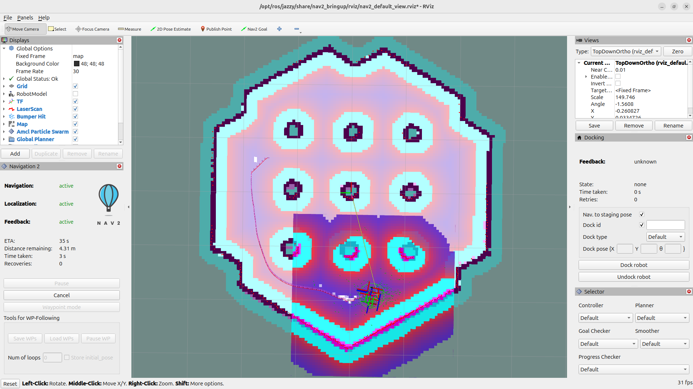
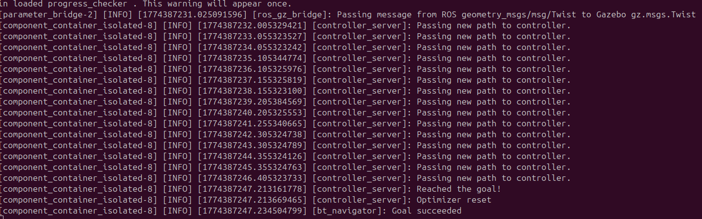
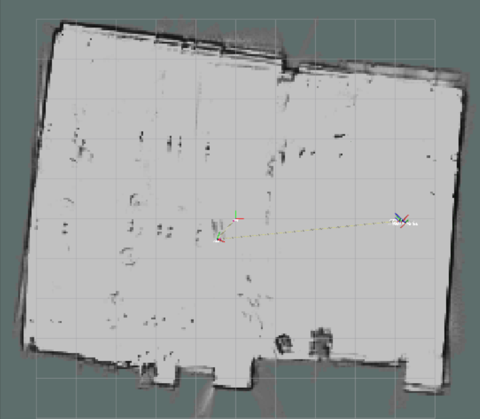
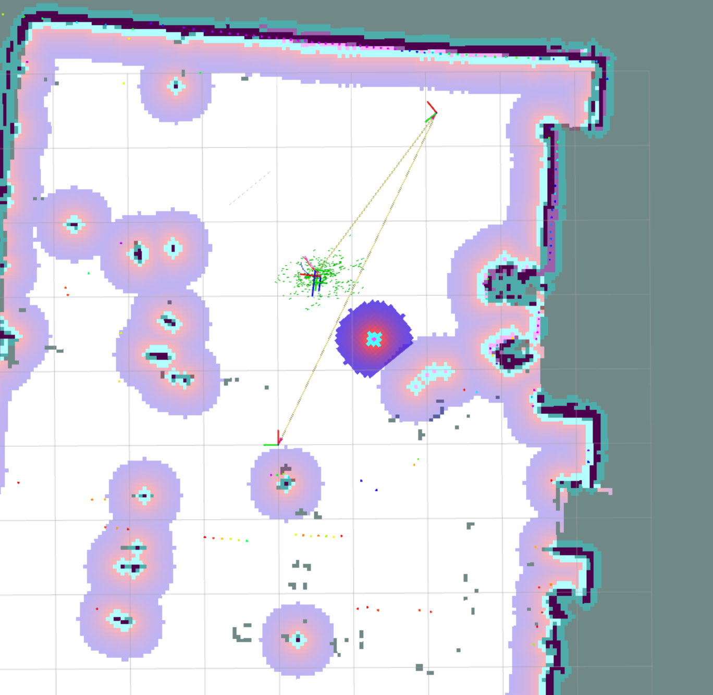
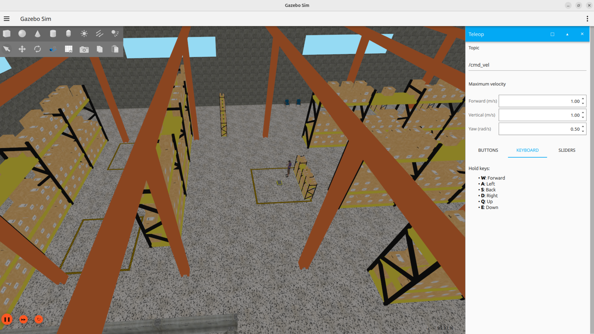
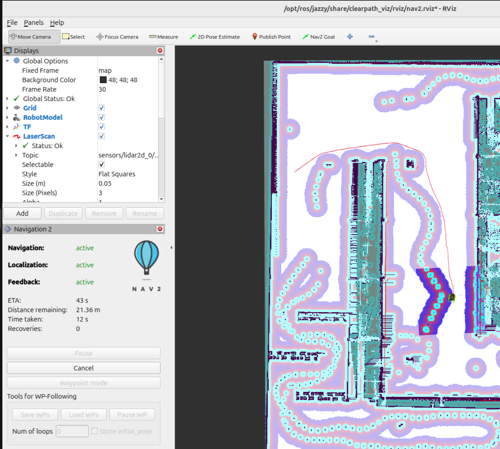

# EE5531 Project 7: Introduction to the ROS2 Navigation Stack

Group 2 - Ian Mattson and William Forney

# Introduction and Setup

In this project, the ROS2 Nav stack is used with the TurtleBot3 Burger to create a SLAM map in both a simple simultated enviornment and the EERC 722 Lab. Additionally, a more realistic simulated enviornment is mapped using the Clearpath Jackal simulation package. 

## Software Versions

All parts of this project were completed using ROS2 Jazzy Jalisco on an Ubuntu 24.04 Noble Numbat operating system.

## Setup Challenges

During the simulation testing, performance and stability issues with Gazebo were encountered. In Part 1, one instance saw the Nav2 target goal pose operate as expected in RViz, but the Turtlebot model in Gazebo did not move. In another instance, the Nav2 stack would not properly initialize.  

These issues were partially resolved by setting the Ubuntu power setting from "balanced" to "performance".  Furthermore, the computer had to be restarted once to properly terminate all gazebo processes and bring them up from scratch again.

# Part 1 - TurtleBot3 Simulation

Part 1 introduces the Nav2 stack through the Turtlebot World simulation enviornment.  When first loaded, the map indicates open, drivable areas as white pixels and barriers, or non-drivable areas as black pixels.  Once the 2D pose estimate is set, cost color layering is applied. Teal areas indicate likely collision areas, followed by a red to blue gradient for all other areas, where red is higher cost (wall is close) and blue is lower cost (wall if far).  Areas between the nine columns are higher cost, so the path planned in Figure 1 planned around the all columns rather than travel between them. 

If the robot becomes stuck, it tries to rotate and try another approach, but if the goal is still unreachable, it fails the execution. A successful route naviation returns a "Goal Reached" message, illustrated in Figure 2.

<u>Figure 1:</u> RViz screenshot illustrating the Turtlebot navigating from the initial starting location to a 2D nav goal, where the route is indicated as the pink line and the cost map is indicated with a gradient of blue (low cost) to red (high cost), with teal areas indicating likely collision areas.

<u>Figure 2:</u> Terminal confirmation of 2D nav goal reached as "Reached the Goal!" and "Goal Succeeded".

# Part 2 - Real-World Mapping of EERC 722

In this section, we expand the Nav2 implementation to real-world hardware by creating a map of EERC 722 with a Turtlebot3, and using the map with Nav2 to autonomously navigate in the room.

## Driving Strategy

The map creation process is delicate, and the map can easily represent errors.  To minimize map artifacts, we drove the Turtlebot3 slowly (about half the maximum speed) and minimuzed rotational turns that affect the localization stack.  We also aimed to follow the room perimeter as reasonably as possible to minimize the amount of double-back manuevers required to cover the entire room area.

## SLAM Map 

The map exhibits some rotational affects in the final product, where the room appears crooked and some artifact wall shadows are present near the edges of the room. This is the result of making several turns to avoid the desk leg layouts in the room, as even though the desks are not large obstacles in the map, the robot could not navigate seamlessly between stools and tables. Given the room's large nature, we found the resulting map in Figure 3 to be the best result we could achieve with the robot.

<u>Figure 3:</u> Resulting SLAM Map Screenshot with some slight rotational noise such that room appears crooked from left to right.  Small occupied pixels in the map represent table and chair legs.

## RVIz Waypoint Navigation

We initialized the robot's location in the corner of the room near the door to the lab such that two walls could be used to help align the 2D pose estimate.  Then, a goal destination was selected with Nav2 in the middle of open space in the center of the room. Figure 4 illustrates the robot nearing the target waypoint from the starting location in the corner.

<u>Figure 4:</u> RViz Nav2 map point-to-point navigation in EERC 722, navigating from the corner near the door to the center of the open floor in the middle of the room.

## Map Files

The generated map files of EERC 722 are avaible in the [maps](./maps/) directory.  The [`map_eerc722.yaml`](./maps/map_eerc722.yaml) contains map metadata and the [`map_eerc722.pgm`](./maps/map_eerc722.pgm) file is a grayscale image representing the enviornment where white pixels are open, black pixels are occupied, and grey pixels are unknown/unavailable.

# Part 3 - Jackal Simulation

In this section, we use the clearpath jackal simulator to explore a larger and more complex simulated environment. As in part 2, we first manually drove the robot around the envronment to build a map using the Nav2 stack, and then demonstrated point-to-point navigation using our generated map.

<u>Figure 5:</u> Screenshot of default warehouse environment used in clearpath simulations in Gazebo.

<u>Figure 6:</u> RViz map showing point-to-point navigation in the clearpath warehouse simulation. 

## Turtlebot3 vs Jackal Nav2 Differences

The biggest difference when setting up Nav2 between the two robots was that the robot.yaml filepath had to be added to the end of the Nav2 and localization launch commands. One weird difference we noticed was that when generating the map for the jackal, the robot would sometimes detect itself and left a trail of detected points that it would navigate around when moving autonomusly. These points can be seen in Figure 6.

## Map Files

The generated map files of the clearpath warehouse are avaible in the [maps](./maps/) directory.  The [`map_jackal_sim.yaml`](./maps/map_jackal_sim.yaml) contains map metadata and the [`map_jackal_sim.pgm`](./maps/map_jackal_sim.pgm) file is a grayscale image representing the enviornment where white pixels are open, black pixels are occupied, and grey pixels are unknown/unavailable.

# AI Disclosure Statement

No AI tools were used in any part of this project